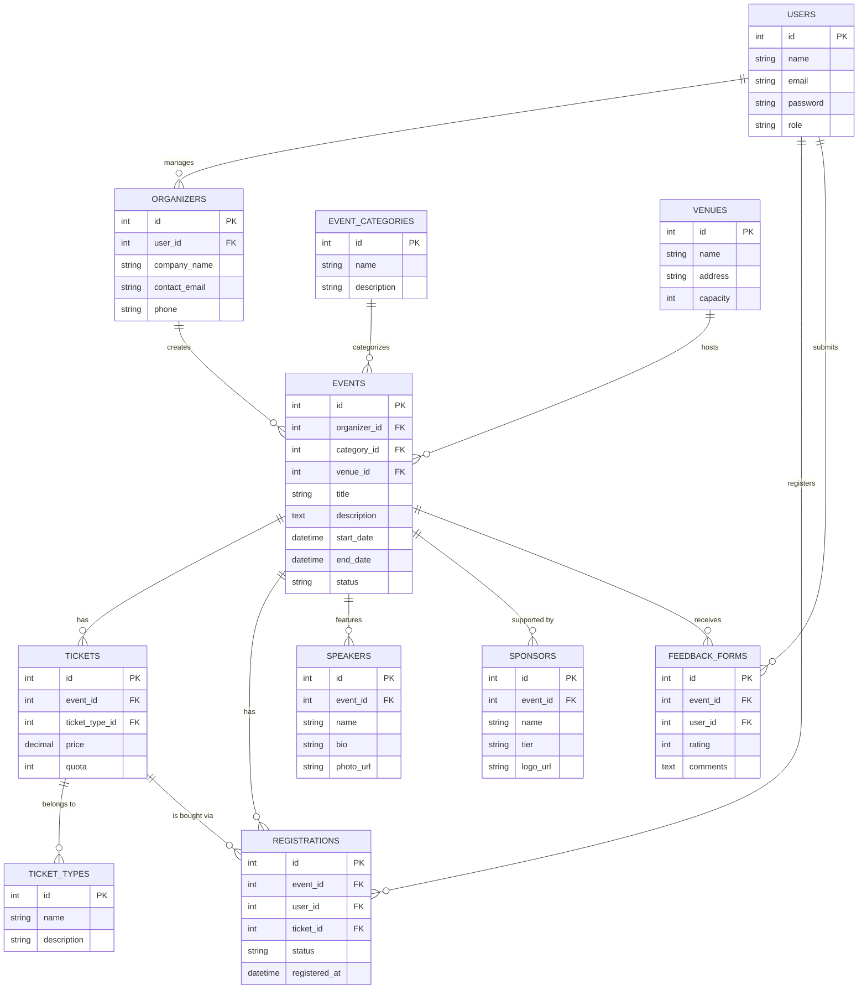

# Product Requirements Document (PRD)
## Sistem Manajemen Event / Acara

---

## 1. Ringkasan Produk

### Problem Statement
Mengelola sebuah acara skala menengah hingga besar seringkali melibatkan banyak alat yang terpisah (spreadsheet untuk pendaftaran, sistem lain untuk tiket, email terpisah untuk komunikasi pembicara dan sponsor). Hal ini menyebabkan inefisiensi, risiko data yang tidak akurat, serta pengalaman pengguna yang kurang mulus baik bagi panitia maupun peserta.

### Tujuan
Membangun platform terpusat (Sistem Manajemen Event) yang memungkinkan penyelenggara mengelola seluruh siklus hidup acara—mulai dari pembuatan acara, pendaftaran peserta, manajemen tiket, pengelolaan pembicara dan sponsor, hingga pengumpulan feedback—di dalam satu sistem yang terintegrasi dan mudah digunakan.

### Target Pengguna
1. **Panitia Event (Organizers):** Pihak yang membuat, merencanakan, dan mengelola jalannya acara.
2. **Peserta (Attendees):** Individu yang mendaftar, membeli tiket, dan menghadiri acara.
3. **Pembicara (Speakers):** Pakar atau narasumber yang akan mengisi sesi di acara tersebut.
4. **Sponsor:** Pihak eksternal yang mendukung acara (secara finansial/logistik) dan memerlukan visibilitas pada event.

---

## 2. Daftar Fitur Utama

- **Pembuatan dan Manajemen Event:** Panitia dapat membuat event baru dengan mengatur jadwal, lokasi (venue), kapasitas, dan kategori event.
- **Jenis Tiket dan Harga:** Mendukung berbagai tipe tiket (misal: VIP, Reguler, Early Bird) dengan harga dan batas kuota masing-masing.
- **Registrasi Peserta Online:** Formulir pendaftaran yang responsif, terintegrasi dengan sistem alokasi tiket dan pengiriman tiket digital/invoice (QR code).
- **Profil Pembicara / Narasumber:** Halaman khusus yang menampilkan daftar pembicara, foto, bio, serta jadwal sesi yang akan mereka bawakan.
- **Manajemen Sponsor:** Ruang bagi panitia untuk mendaftarkan sponsor beserta tingkat/tier (misal: Platinum, Gold) dan menampilkan logo sponsor di halaman event.
- **Feedback dan Evaluasi Acara:** Sistem survei otomatis pasca-acara bagi peserta untuk memberikan penilaian dan masukan.
- **Laporan Kehadiran Peserta:** Dashboard analitik untuk panitia melacak jumlah pendaftar, penjualan tiket, dan tingkat kehadiran aktual (check-in).

---

## 3. Peran Pengguna (User Roles) & Hak Akses

| Role | Hak Akses |
| --- | --- |
| **Superadmin** | Mengelola seluruh data di sistem, menyetujui akun organizer baru, melihat statistik global sistem. |
| **Organizer (Panitia)** | Membuat & mengedit event miliknya, mengelola tiket, menambah pembicara/sponsor, melihat laporan pendaftar & feedback. |
| **Attendee (Peserta)** | Melihat daftar event, mendaftar event, melihat tiket miliknya, mengisi form feedback. |
| **Speaker (Narasumber)**| (Opsional) Mengelola profil bio, mengunduh jadwal sesinya. |
| **Sponsor** | (Opsional) Melihat dashboard visibilitas dan mengelola material promosi mereka. |

---

## 4. Skema Data & Arsitektur

### Penjelasan Naratif Tabel

Selain tabel standar `users` dan `settings`, sistem membutuhkan 10 tabel inti sebagai berikut:

1. **`event_categories`**: Menyimpan kategori dari event (misal: Teknologi, Musik, Seminar, dll).
2. **`organizers`**: Data detail dari penyelenggara (nama organisasi, kontak, deskripsi) yang berelasi ke user penanggung jawab.
3. **`venues`**: Tempat berlangsungnya acara, berisi nama lokasi, alamat lengkap, kapasitas maksimum, dan titik koordinat.
4. **`events`**: Tabel utama yang berisi informasi acara (judul, deskripsi, tanggal mulai/selesai, status, berelasi dengan venue, organizer, dan category).
5. **`ticket_types`**: Menyimpan jenis tiket (Early Bird, Reguler) untuk suatu acara.
6. **`tickets`**: Informasi fisik/digital dari setiap tiket yang digenerate untuk sebuah acara (termasuk harga, nama tiket, kuota awal, dsb).
7. **`registrations`**: Data transaksi pendaftaran peserta yang mengikat user (attendee), event, dan ticket beserta status pembayarannya.
8. **`speakers`**: Profil narasumber acara (nama, bio, perusahaan, foto).
9. **`sponsors`**: Data sponsor pendukung acara (nama perusahaan, logo, website, tingkat sponsorship).
10. **`feedback_forms`**: Data evaluasi atau rating yang diisi oleh peserta setelah acara berakhir.

### Visualisasi ERD

---

## 5. User Flow Utama

### A. Alur Pembuatan Event oleh Panitia (Organizer)
1. **Login & Akses Dashboard:** Panitia login ke dalam sistem dan diarahkan ke Dashboard Organizer.
2. **Buat Event Baru:** Klik tombol "Create New Event".
3. **Isi Detail Utama:** Memasukkan judul, deskripsi, tanggal/waktu acara.
4. **Pilih Kategori & Venue:** Memilih `event_categories` yang sesuai dan memilih/membuat entri `venues`.
5. **Atur Tiket:** Menambahkan jenis tiket pada acara tersebut dengan menentukan tipe (`ticket_types`), harga, dan kuota.
6. **Tambah Entitas Ekstra (Opsional):** Menambahkan profil Pembicara (`speakers`) dan Sponsor (`sponsors`).
7. **Publish Event:** Mengubah status event menjadi 'Published' sehingga dapat dilihat oleh publik.

### B. Alur Pendaftaran Peserta (Attendee)
1. **Eksplorasi Event:** Peserta (meskipun belum login) melihat daftar event yang tersedia di halaman utama (Katalog Event).
2. **Pilih Event & Tiket:** Mengklik salah satu event dan melihat detailnya. Memilih jenis tiket yang akan dibeli/didaftarkan.
3. **Login / Register:** Sistem akan meminta pengguna untuk Login atau membuat akun jika belum terautentikasi.
4. **Checkout & Pembayaran:** Peserta mengisi form data diri tambahan (jika ada) dan melanjutkan ke proses konfirmasi. (Sistem mencatat `registrations` dengan status *Pending*).
5. **Konfirmasi:** Setelah pendaftaran disetujui (atau pembayaran berhasil), status berubah menjadi *Confirmed*.
6. **Terima E-Ticket:** Peserta menerima tiket digital (bisa berisi QR Code) melalui dashboard peserta dan/atau email.
